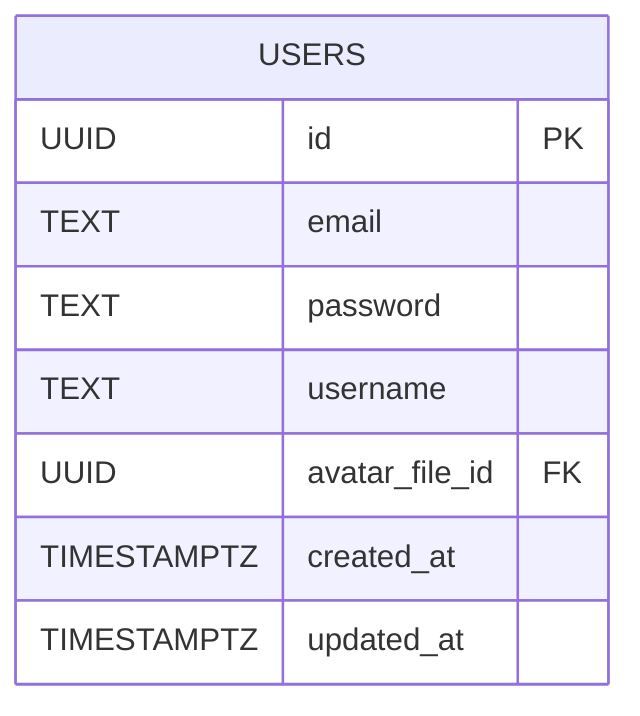

# Нормализованные отношения и функциональные зависимости

## Краткие описания таблиц

* **USER** — аккаунты пользователей: учётные записи, логины, имя и привязка аватара.
* **FILE** — загруженные файлы с метаданными (тип, размеры, вес, URL).
* **NOTE** — заметки (дерево родитель→дети), владельцы, заголовки, статус архива, иконки.
* **BLOCK** — атомарные блоки контента внутри заметок (тип, порядок).
* **BLOCK_TEXT_SPAN** — фрагменты форматируемого текста внутри текстового блока (позиции, стиль).
* **BLOCK_CODE** — содержимое кода для код‑блоков (язык, текст кода).
* **ATTACHMENT** — файловые вложения блоков (файл и подпись).
* **NOTE_PERMISSION** — выданные права на заметки (кому, кем, какая роль, шаринг).
* **FAVORITE** — отметки «в избранном» (кто какую заметку добавил).
* **TAG** — теги и автор их создания.
* **NOTE_TAG** — связь заметок с тегами.

> Обозначения: `PK` — первичный ключ; `FK` — внешний ключ; ФЗ — функциональные зависимости в виде `X → Y`.

---

## USER(id, email, password, username, avatar_file_id, created_at, updated_at)

**PK:** `{id}`  
**FK:** `avatar_file_id → FILE(id)`

**ФЗ (минимальные)**

* `id → email, password, username, avatar_file_id, created_at, updated_at`
* `email → id` *(следовательно, `email → password, username, avatar_file_id, created_at, updated_at`)*

**Нормальные формы**

* **1НФ:** да (атомарность).
* **2НФ:** да (PK не составной).
* **3НФ:** да (нет транзитивных зависимостей от ключа).
* **НФБК:** да (все детерминанты — суперклавиши `id`, `email`).

---

## FILE(id, url, mime_type, size_bytes, width, height, created_at)

**PK:** `{id}`

**ФЗ**

* `id → url, mime_type, size_bytes, width, height, created_at`

**Нормальные формы:** 1НФ, 2НФ, 3НФ, **НФБК** — да.

---

## NOTE(id, owner_id, parent_note_id, title, icon_file_id, is_archived, created_at, updated_at, deleted_at)

**PK:** `{id}`  
**FK:** `owner_id → USER(id)`; `parent_note_id → NOTE(id)`; `icon_file_id → FILE(id)`

**ФЗ**

* `id → owner_id, parent_note_id, title, icon_file_id, is_archived, created_at, updated_at, deleted_at`

**Нормальные формы:** 1НФ, 2НФ, 3НФ, **НФБК** — да.

---

## BLOCK(id, note_id, type, position, created_at, updated_at)

**PK:** `{id}`  
**FK:** `note_id → NOTE(id)`

**ФЗ**

* `id → note_id, type, position, created_at, updated_at`
* `(note_id, position) → id, type, created_at, updated_at` 

**Нормальные формы:** 1НФ, 2НФ, 3НФ, **НФБК** — да.

---

## BLOCK_TEXT_SPAN(block_id, position, text, bold, italic, underline, strikethrough, font, size, created_at, updated_at)

**PK:** `{block_id, position}`  
**FK:** `block_id → BLOCK(id)`

**ФЗ**

* `(block_id, position) → text, bold, italic, underline, strikethrough, font, size, created_at, updated_at`

**Нормальные формы**

* **1НФ:** да.
* **2НФ:** да (все неключевые зависят от **всего** составного ключа).
* **3НФ:** да (нет транзитивных зависимостей).
* **НФБК:** да (единственный детерминант — составной ключ).

---

## BLOCK_CODE(block_id, language, code_text, created_at, updated_at)

**PK:** `{block_id}`  
**FK:** `block_id → BLOCK(id)`

**ФЗ**

* `block_id → language, code_text, created_at, updated_at`

**Нормальные формы:** 1НФ, 2НФ, 3НФ, **НФБК** — да.

---

## ATTACHMENT(id, block_id, file_id, caption, created_at)

**PK:** `{id}`  
**FK:** `block_id → BLOCK(id)`; `file_id → FILE(id)`

**ФЗ**

* `id → block_id, file_id, caption, created_at`

**Нормальные формы**

* **1НФ:** да.
* **2НФ:** да (PK не составной).
* **3НФ:** да (нет транзитивных зависимостей от `id`).
* **НФБК:** да (детерминант — только ключ `id`).

---

## NOTE_PERMISSION(note_permission_id, note_id, granted_by, granted_to, role, can_share, granted_at, updated_at)

**PK:** `{note_permission_id}`  
**FK:** `note_id → NOTE(id)`; `granted_by → USER(id)`; `granted_to → USER(id)`

**ФЗ**

* `note_permission_id → note_id, granted_by, granted_to, role, can_share, granted_at, updated_at`

**Нормальные формы**

* **1НФ:** да.
* **2НФ:** да (все неключевые зависят от всего ключа).
* **3НФ:** да.
* **НФБК:** да.

---

## FAVORITE(user_id, note_id, created_at)

**PK:** `{user_id, note_id}`  
**FK:** `user_id → USER(id)`; `note_id → NOTE(id)`

**ФЗ**

* `(user_id, note_id) → created_at`

**Нормальные формы:** 1НФ, 2НФ, 3НФ, **НФБК** — да.

---

## TAG(id, name, created_by, updated_at, created_at)

**PK:** `{id}`  
**FK:** `created_by → USER(id)`

**ФЗ**

* `id → name, created_by, updated_at, created_at`
* `name → id` *(следовательно, `name → created_by, updated_at, created_at`)*

**Нормальные формы:** 1НФ, 2НФ, 3НФ, **НФБК** — да (детерминанты — ключи `id`/`name`).

---

## NOTE_TAG(note_id, tag_id, created_at)

**PK:** `{note_id, tag_id}`  
**FK:** `note_id → NOTE(id)`; `tag_id → TAG(id)`

**ФЗ**

* `(note_id, tag_id) → created_at`

**Нормальные формы:** 1НФ, 2НФ, 3НФ, **НФБК** — да.

---